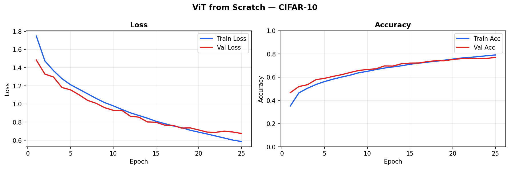
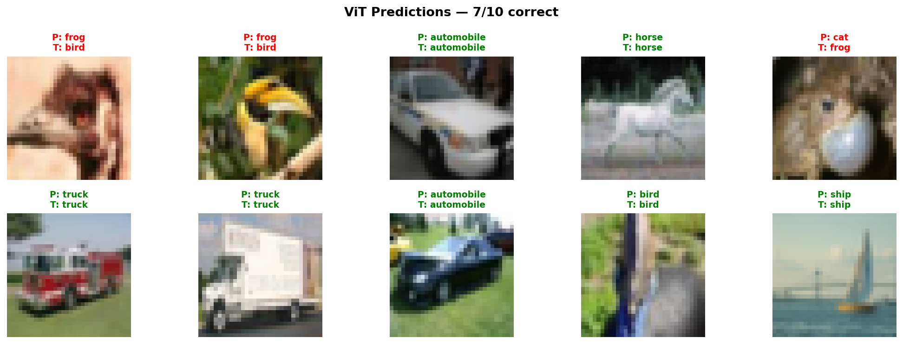

# Vision Transformer (ViT) from Scratch 🔬

Implementation of **"An Image is Worth 16x16 Words"**  
(Dosovitskiy et al., 2020) — built completely from scratch in PyTorch.

No pretrained weights. No ViT libraries. Just the paper, blogs, and code.

---

## Results 📊

| Dataset  | Val Accuracy | Epochs | Training |
|----------|-------------|--------|----------|
| CIFAR-10 | **77.08%**  | 25     | Scratch, no pretraining |




---

## Why I built this

I was learning how attention works in LLMs and wanted to understand  
how the same idea applies to images.  
So I read the ViT paper, understood the architecture,  
and coded every single component from scratch.

---

## Project Structure 📁

```
VIT_Scratch/
│
├── Model/
│   ├── Embeddings.py                 # Patch embedding via Conv2d
│   ├── LayerNorm.py                  # Layer normalization
│   ├── MSA.py                        # Multi-Head Self Attention
│   ├── MLP.py                        # Feed Forward block
│   ├── Transformer_Encoder_Block.py  # Full transformer block
│   └── Vision_.py                    # Main ViT model
│
├── Config.py                         # Model hyperparameters
├── train.py                          # Training script
├── predict.py                        # Prediction + visualization
├── Vit_Scratch.ipynb                 # Full training notebook
└── assets/
    ├── training_curves.png           # Loss + accuracy graphs
    └── predictions.png               # Sample predictions
```

---

## Architecture ⚙️

Every component built from scratch:

- **Patch Embedding** — Conv2d with kernel=4, stride=4 splits  
  32×32 image into 64 patches, projects to embedding dim
- **CLS Token** — learnable token that aggregates global info
- **Positional Embeddings** — learnable 1D position encodings
- **Multi-Head Self Attention** — separate W_Q, W_K, W_V projections,  
  scaled dot-product attention, output projection W_O
- **Pre-LN Transformer Block** — LayerNorm before attention  
  (more stable than original paper's Post-LN)
- **Feed Forward MLP** — two linear layers with GELU activation
- **6 transformer layers, 8 attention heads, 192 embedding dim**

---

## Config ⚡

| Parameter       | Value            |
|----------------|------------------|
| Image size      | 32×32            |
| Patch size      | 4×4              |
| Num patches     | 64               |
| Embedding dim   | 192              |
| Attention heads | 8                |
| Layers          | 6                |
| Dropout         | 0.1              |
| Optimizer       | AdamW            |
| Scheduler       | Cosine Annealing |
| Grad clipping   | 1.0              |

---

## What I learned building this 🧠

- Why patch embeddings via Conv2d is mathematically  
  equivalent to manual patch extraction
- How CLS token aggregates global image information  
  across all 64 patches
- Why **Pre-LN** trains more stably than Post-LN  
  from the original paper
- Why **gradient clipping** is important for transformer training
- Why **data augmentation** (random crop, flip) should only  
  apply to training, never evaluation
- How scaled dot-product attention prevents vanishing  
  gradients in softmax

---

## Run it yourself 🚀

```bash
pip install torch torchvision tqdm matplotlib
python train.py
```

Or open `Vit_Scratch.ipynb` in Kaggle/Colab for full walkthrough.

---

## Reference

- Paper: [An Image is Worth 16x16 Words](https://arxiv.org/abs/2010.11929)

---

*Built by a self-taught 18 year old from Nanded, Maharashtra.*  
*No degree. Just curiosity and code.* 🔥
